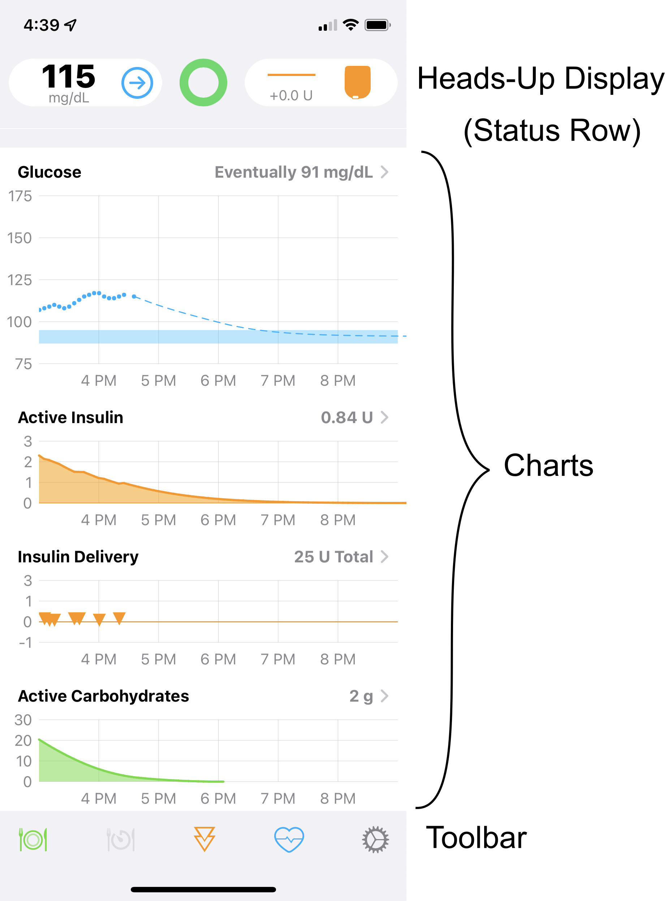

## Know your settings

Do not enter settings that you are unsure of. For example, if you haven't any idea what your carb ratio is, please don't enter a wild guess. Instead, test your settings and talk to your health care provider about what your appropriate settings should be.

## iOS *Focus* Notifications

iPhones have [*Focus* modes](https://support.apple.com/en-us/108302){: target="_blank" } to enable maximum flexibility for notifications. These modes must be configured by each user to allow important notifications from your diabetes apps.

**Set up every *Focus* mode you use to allow glucose alerts or you will not get them.**

Critical notifications, for example, urgent low from Dexcom, are enabled regardless of your *Focus* settings. But regular low and high glucose notifications might be suppressed. Open source apps, like the *Loop* app, can only be allowed to notify during a *Focus* mode when configured by the user.

Under iOS Settings, select *Focus*, then choose the *Focus* mode you want to adjust.

The graphic below has numbered highlights to follow along for configuring Sleep focus initially:

1. Enable Time Sensitive Notifications (disabled by default)
2. Tap on the &plus; sign to add Apps that are allowed to notify in this mode
3. Use the search feature to find apps of interest
4. Tap on the radio button to select apps of interest, the check mark means that app will be added
    * If you use additional apps to provide alerts, be sure to add them to *Focus* as well

{width="450"}
{align="center"}

The little clock icon indicates that time-sensitive notifications are enabled. The other icons represent the apps you added to have permission to notify you when in this *Focus* mode.

Be sure to do this for every *Focus* mode you use.

## Understand the App Displays

If you do not understand the components displayed in the graphic below, please spend time reviewing the information at [Displays](../loop-3/displays-v3.md).

{width="450"}
{align="center"}

## Carb Entry and Insulin Delivery

If you configured the app with closed-loop enabled:

* Once carbohydrates are entered into&nbsp;_Loop_, the algorithm will begin to dose insulin to anticipate those carbs

If you entered carbs and then changed your mind on the amount or the time at which they were eaten, use these [instructions](../operation/features/carbs.md#edit-meals) to delete or edit them. This will make&nbsp;_Loop_&nbsp;better able to predict blood glucose and adjust insulin delivery appropriately.

## How to Cancel a Bolus

Once a bolus starts, the progress of that bolus appears in the [HUD Status Row](../loop-3/displays-v3.md#hud-status-row). Note that the phone must be held in portrait mode to see this. Simply tap on the row that shows the delivery to halt the bolus.

{width="350"}

## Understand Delivery Limits

With each cycle, _Loop_&nbsp;generates a glucose prediction and a recommended dose (positive or negative) to bring you to your correction range.

* The automated response to a positive recommended dose depends on your Dosing Strategy and is adjusted by your Delivery Limits

For more information, please read [How do Delivery Limits Affect Automatic Dosing?](algorithm-faqs.md#how-do-delivery-limits-affect-automatic-dosing).

## Health app permissions

For older versions of&nbsp;_Loop_, or if you customized&nbsp;Loop 3&nbsp;to read carbohydrates from third-party apps, be aware that you cannot edit those entries inside the&nbsp;_Loop_&nbsp;app.

If you let other apps, such as MyFitnessPal, write carbohydrates to the Health app, _Loop_&nbsp;could read those carbohydrates and you could be dosed for those carbohydrates.

* Loop 3: review [Customization: Build Time Features](../version/build-time-flag.md)

## Glucose Prediction is Scary

Users often reach out if the glucose prediction shown on the *Loop* app screen is very low - negative even.

* The negative glucose prediction will not happen (that's just the way the model works) but the user **must** figure out what is going on

### Scenario 1: Extreme Override

It is pretty common for new users to think a 10% override setting should behave similarly to a 10% temporary basal rate setting on a manual pump. This is not true.

Read this section on the override page for information: [Avoid Extreme Insulin Needs Setting](../operation/features/overrides.md#avoid-extreme-insulin-needs-setting)

### Scenario 2: Entry Error into Apple Health

With version 3 of the *Loop* app, it is no longer necessary to enter glucose or insulin manually into the *Apple Health* app for the *Loop* app to read. There are methods within the *Loop* app for entering a fingerstick value or non-pump insulin.

However, some people are used to entering information into *Apple Health* directly - and it still works. The *Loop* app will read entries from *Apple Health*. But if you do this:

* Be very careful that you enter glucose into glucose
* Be very careful that you enter insulin into insulin

A recent user entered a fingerstick value into the insulin record in *Apple Health*. They use mmol/L glucose units, so it wasn't as obvious as it would have been for someone using mg/dL. At any rate, they could not figure out why their child had such a high IOB and were afraid the pump had delivered 10 U of insulin! Once they deleted the incorrect entry from *Apple Health*, the *Loop* app was able to make the appropriate prediction.

## Beware the Medtronic Easy Bolus button

Medtronic's easy bolus button has been the cause of several accidental boluses when the pump has been carried in a pocket. Best practice would be to disable the Easy Bolus button since you will be doing boluses from the phone anyways.

## Finish your Medtronic priming

After a site change and reservoir rewind, Medtronic's pump will have a menu on the pump screen related to finishing your prime. Make sure you complete that screen and always return to the main menu. Medtronic's pump won't resume basal insulin delivery until that priming screen is completed.
